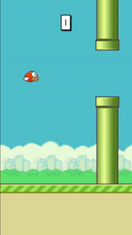

# Flappy Bird
Flappy Bird recreated in PyGame




## Installation and Running

Make sure Python 3.11 and PyGame are installed on your system.

Download the zip and open a terminal inside the folder.

Run the Game with:
```bash
  python main.py
```
